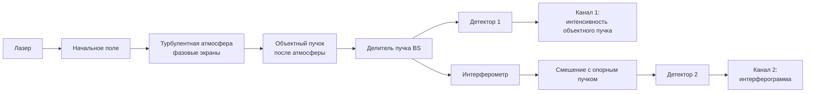
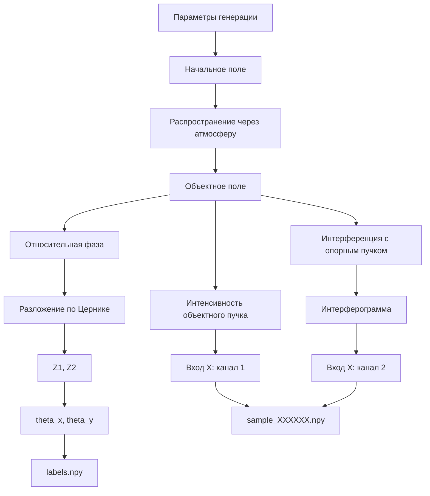

# Схема моделируемой системы

В проекте моделируется задача восстановления глобального наклона волнового фронта по двум изображениям: интенсивности объектного пучка и интерферограмме.

Каждый сэмпл имеет вид

$$
X_i \in \mathbb{R}^{2\times128\times128}.
$$

Метка имеет вид

$$
y_i = (Z_1, Z_2, \theta_x, \theta_y).
$$

---

## 1. Общая оптическая схема



Физически моделируется цепочка:

1. задаётся начальное комплексное поле лазерного пучка;
2. поле распространяется через несколько фазовых экранов;
3. после атмосферы формируется объектный пучок;
4. отдельно строится опорный пучок;
5. объектный и опорный пучки смешиваются в интерферометрической схеме;
6. сохраняются два изображения: интенсивность и интерферограмма;
7. по относительной фазе вычисляются коэффициенты \(Z_1, Z_2\) и углы \(	heta_x, 	heta_y\).

---

## 2. Формирование одного сэмпла



Один файл `sample_XXXXXX.npy` содержит два канала:

```python
sample.shape == (2, 128, 128)

sample[0]  # интенсивность объектного пучка
sample[1]  # интерферограмма
```

Метка хранится отдельно в `labels.npy`:

```python
labels[i] == [Z1, Z2, theta_x, theta_y]
```

---

## 3. Связь коэффициентов Цернике и углов

Коэффициенты \(Z_1, Z_2\) переводятся в углы наклона по формулам

$$
\theta_x = \frac{Z_1}{kR},
\qquad
\theta_y = \frac{Z_2}{kR},
$$

где

$$
k = \frac{2\pi}{\lambda}.
$$

Здесь \(\lambda\) — длина волны, а \(R\) — радиус апертуры, на которой выполняется разложение.

---

## 4. Параметры, которые варьируются при генерации

| Параметр | Смысл |
|---|---|
| \(w_0\) | радиус начального гауссова пучка |
| distance | длина атмосферной трассы |
| \(r_0\) | параметр Фрида |
| \(L_0\) | внешний масштаб турбулентности |
| \(l_0\) | внутренний масштаб турбулентности |
| carrier fringes | число несущих полос интерферограммы |
| path difference | разность хода в интерферометре |

В массиве `params.npy` параметры хранятся в порядке:

```python
[
    w0_m,
    distance_m,
    r0_m,
    L0_m,
    l0_m,
    carrier_fringes,
    path_difference_m,
]
```

---

## 5. Структура датасета

```text
dataset_tilt_randomized_20k/
│
├── samples/
│   ├── sample_000000.npy
│   ├── sample_000001.npy
│   └── ...
│
├── labels.npy
├── zernike_coefficients.npy
├── params.npy
├── source_ids.npy
├── metadata.json
└── README_RU.md
```

| Файл | Содержимое |
|---|---|
| `samples/sample_XXXXXX.npy` | два входных изображения формы `(2, 128, 128)` |
| `labels.npy` | целевые значения `(Z1, Z2, theta_x, theta_y)` |
| `zernike_coefficients.npy` | коэффициенты Цернике для относительной фазы |
| `params.npy` | параметры физической генерации |
| `source_ids.npy` | идентификатор исходной части датасета |
| `metadata.json` | параметры генератора и порядок величин |

---

## 6. Вход и выход модели

На вход нейросети подаются два изображения:

```text
канал 0: интенсивность объектного пучка
канал 1: интерферограмма
```

Задача модели:

```text
(2, 128, 128) -> (Z1, Z2)
```

После этого углы наклона вычисляются как

$$
\theta_x = \frac{Z_1}{kR},
\qquad
\theta_y = \frac{Z_2}{kR}.
$$

---

## 7. Минимальная проверка одного сэмпла

```python
import numpy as np

dataset_dir = "dataset_tilt_randomized_20k"

sample = np.load(f"{dataset_dir}/samples/sample_000000.npy")
labels = np.load(f"{dataset_dir}/labels.npy")
params = np.load(f"{dataset_dir}/params.npy")

print(sample.shape)
print(labels[0])
print(params[0])
```

Ожидаемо:

```text
(2, 128, 128)
[Z1, Z2, theta_x, theta_y]
[w0, distance, r0, L0, l0, carrier_fringes, path_difference]
```

---

## 8. Назначение моделирования

Датасет нужен для обучения модели, которая по двум регистрируемым изображениям восстанавливает глобальный наклон волнового фронта. В дальнейшем это можно использовать как часть системы адаптивной оптики для оценки и компенсации tip/tilt-компонент.
